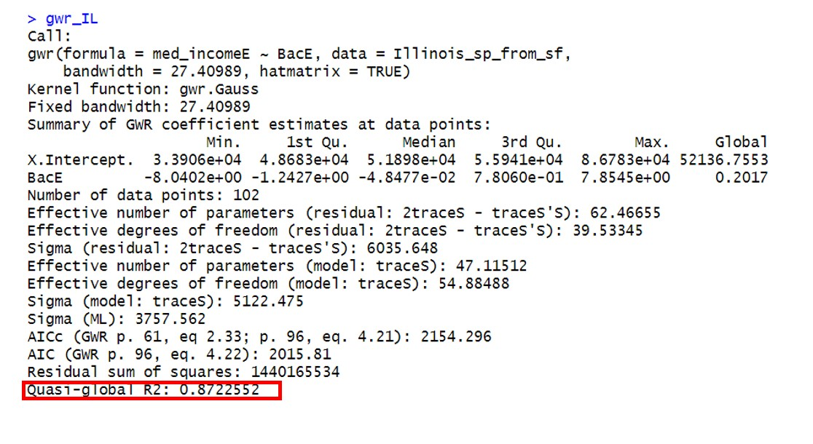

## Objectives
1. Conduct global and local Moran's I in R
2. Conduct geographically weighted regression in R
3. Interpret results and the describe the spatial pattern

## Overview 

Please make sure to install and load the following packages. 
```{r eval=F}
# read spatial data 
library(sf)
# Create maps
library(tmap)
library(tmaptools)
# Basic data manipulation
library(tidyverse)
# Package for spatial autocorrelation
library(spdep)
# Package for geographically weighted regression
library(spgwr)
```

```{r echo=F}

xfun::embed_file('data.zip')


```

In this lab, we will introduce how to conduct sptial autocorrelation and geographically weighted regression in R.  For more information about spatial dataset in R, click [*here*](https://maczokni.github.io/crimemapping_textbook_bookdown/global-and-local-spatial-autocorrelation.html). 

## 1. Spatial autocorrelation: population in Illinois at county level (global model)

Let's first check out spatial autocorrelation. Based on the first law of geography: "everything is related to everything else, but near things are more related than distant things", let's check out if the population in Illinois is significant or not spatially. 

Here we will check out a polygon datasets in Illinois (downloaded from esri website), which includes the population at county level for both 2000 and 2010. It also includes population by gender in 2010. 


```{r eval=F}
Illinois <- st_read("data/Illinois_pop.shp")
class(Illinois)

```

Let's first explore the population distribution in 2000. A basic choropleth map with natural breaks classification will help here. So you can check it out visually that population seems to cluster around cook county. We need to statistically test if the pattern is significant or not. 

```{r eval=F}
tm_shape(Illinois) + tm_polygons(style="jenks", col = "POP2000") +
  tm_legend(outside = TRUE, text.size = .8)
```

To conduct spatial autocorrelation at global level, the first step is to define “neighboring” polygons. “Neighboring” polygons refer to contiguous polygons. But we need to be clear for each polygon in the data, which nearby polygon is a neighbor and which is not a neighbor. The function is called "poly2nb" in the `spdep` package. 

Here, we’ll define use "queen" method to define neighbors: as far as they share boarder and a point, we will treat it as a neighbor.  So we would set queen=True. 

```{r eval=F}

nb <- poly2nb(Illinois, queen=TRUE)
```


The returned object is a list with 102 items, which means it labels neighbors for each county. For example, for the first county, county number 29 and 53 are its neighbors. To figure out the name for that county, we can simply use this index to track back their name. So for Lake county, the neighbors are Cook and McHenry county. 

```{r eval=F}
nb[[1]]
Illinois$NAME[c(1,29,53)]

```


Next we need to figure out weights to each neighboring polygons. Here we will use the basic binary form (`style="B"`) to label the neighbors: 0 weight for non-neighboring polygon, and 1 weight for neighboring polygon. 
The function is `nb2listw`. Here style can take values “W”, “B”, “C”, “U”, and “S”, where:

Code|Description
-------|---------
W|Row standardized (sums over all links to n)
C|Globally standardized (sums over all links to n)
B|Basic binary coding
U|Equal to C divided by the number of neighbors (sums over all links to unity)
S|Variance-stabilizing coding scheme

We set `zero.policy=TRUE` option to allow list of non-neighbors. You can use `?nb2listw` for more information. 

```{r eval=F}
lw <- nb2listw(nb, style="B", zero.policy=TRUE)
```

Let's check out the weight of the first polygon’s neighbors (for Lake county, the neighbors are Cook and McHenry county). Both have weight as 1. 

```{r eval=F}
lw$weights[1]
```


We can further compute the average neighbor population value for each county.  These average values are named **spatially lagged** values.
```{r eval=F}
lag_pop <- lag.listw(lw, Illinois$POP2000)
```

We have already defined neighbors and weight for each county, so we can compute Moran's I statistics to see if the spatial pattern of population is significant. We can directly use the `moran.test` function. The first input is the attribute you want to test here, and followed the weight matrix. 

```{r eval=F}
moran.test(Illinois$POP2000,lw)
```

### Conclusion for the global model:

As we mentioned in the lecture, our p-value is less than 0.05 (2.2e-16). So we reject the null hypothesis that the population pattern is statistically significant for the entire state. The Moran I statistic is 0.167, which is positive, indicates there is a cluster for the dataset. 


## 2. Spatial autocorrelation: population in Illinois at county level (local model)

Based on the conclusions of global test, we can further break it down at local level. So where is the cluster of population in space? Is it high value cluster or low value cluster? Since we already defined neighbors and weights, we can directly move to a local test using `localmoran` function. Note for each polygon, a Moran I statistic will be returned, same for p-value. So the output of the local model has 102 rows. 

But if you print out local_model, you have 5 columns. For each column: Il:Moran I statistic; E.Il: Expectation of local moran statistic; Var.Il: variance of local moran statistic; Z.Ii:Standard deviate of local moran statistic; Pr: p-value of local moran statistic. The p-value for each polygon will identify if this polygon has statistically different value than its neighbors. 

```{r eval=F}
local_model <- localmoran(Illinois$POP2000, lw)

# Simply get the five number of summary of each column.
summary(local_model)
```

If we want to figure out is if there is a high or low value cluster, we need to compare the value for each polygon with its neighbors. For each county, we need to compare  1) the population value for this county; 2) the **spatially lagged** values for this county (average for neighbors); 3) P-value for this county. For any county, only p-value less than 0.05 will be treated as significant. 

To compare different population values, we first scale all both 1) the population value for this county; 2) the **spatially lagged** values for this county (average for neighbors). We save the scaled values as `s_POP2000` and `s_lag_POP2000.` These two columns are also appended at the end of our polygon. 

```{r eval=F}
Illinois$s_POP2000 <- scale(Illinois$POP2000)

Illinois$s_lag_POP2000 <- lag.listw(lw, Illinois$s_POP2000)
```


Now we use `ifelse` to set conditions and group each county into five categories. A new column called quad_sig will be generated at the end of our table, indicates these five groups: 


- HH:high values surrounded by high values (both scaled population and lagged values are positive. At the same time, p-value is less than 0.05)

- LL:low values surrounded by low values (both scaled population and lagged values are negative.  At the same time, p-value is less than 0.05)

- HL:high values surrounded by low values (scaled population is positive but lagged values are negative.  At the same time, p-value is less than 0.05)

- LH:low values surrounded by high values (scaled population is negative but lagged values are positive.  At the same time, p-value is less than 0.05)

- Any other values: not siginificant (Any other possibility, e.g. p-value>0.05)

```{r eval=F}

Illinois <- Illinois %>% mutate(
    quad_sig = ifelse(Illinois$s_POP2000 > 0 & 
                    Illinois$s_lag_POP2000 > 0 &  
                        local_model[,5] <= 0.05, 
                    "high-high",
                                                  
                     ifelse(Illinois$s_POP2000 <= 0 & 
                              Illinois$s_lag_POP2000 <= 0 & 
                              local_model[,5] <= 0.05, 
                     "low-low", 
                     ifelse(Illinois$s_POP2000 > 0 & 
                              Illinois$s_lag_POP2000 <= 0 & 
                              local_model[,5] <= 0.05, 
                     "high-low",
                     ifelse(Illinois$s_POP2000 <= 0 & 
                              Illinois$s_lag_POP2000 > 0 & 
                              local_model[,5] <= 0.05,
                     "low-high", 
                     "non-significant")))))


```


### Conclusion for the local model:

Let's create a map to see how these groups distributed. Here we color each polygon by the group called "quad_sig"
So only counties around cook county are labeled as High-High group. That means these counties have high population, and also surrounded by counties with high population value. There is no significant relationship found in other counties.  

```{r eval=F}
tm_shape(Illinois) + tm_polygons(col = "quad_sig") +
  tm_legend(outside = TRUE, text.size = .8)
```


## 3. GWR-Examine Income and educational level in Illinois

Now let's move to GWR functions in R. We are interested to see if there is a positive relationship between household income and educational level. We assume that for each county, if more people holding a Bachelor's degree, the median household income should be higher too. We will derectly use census API in R to get the dataset for entire Illinois at county level. 


### 3.1 Get data ready from census api

Note for this lab, you need to have your census API key ready. The variables we need to extract are:  1) median household income (med_income): B19013_001; 2) Total population(pop) B01003_001; 3) Total BACHELOR'S DEGREES REPORTED (Bac): B15012_011. 

For your own term project and if you plan to use census data,  you have to decide which variable to use first. 

```{r eval=F}
# Load the package and your key
library(tidycensus)
census_api_key("Put you key here")

# Check out avaiable variables in ACES 5 survey. 
# You have to examine this code table for your term project!

table_code <- load_variables(2017, "acs5", cache = TRUE)

# We decide to get these three variables. 
# We can name the variable here to make the table more readable. 

vars <- c(Pop="B01003_001", Bac="B15012_011",med_income="B19013_001")

# Get the dataset at county level in Illinois. Keep the geometry to plot maps. 

# "Wide" here to get a `cleaner` table

Illinois_2017<-get_acs(geography = "county", 
              variables =vars,year=2017, 
              survey="acs5", state="Illinois", 
              output="wide", geometry=T)

```

Take a look at the dataset, it has 102 rows and 9 variables. GEOID is the five number code to represent each county uniquely; NAME represent the name of the county. geometry is the list-column for spatial information. You get two columns for each variable: the one end with "E" estimation of the variable, we will analysis estimation for this lab. The one end with "M" represents margin of error. Margins of error is an indicator of the reliability of the estimate, with upper- and lower-bound of a range provided. Here we just drop of Margins of error to simply analysis estimations. We save the clean dataset as "Illinois_2017_clean". Note it should still include the spatial component. 

```{r eval=F}
Illinois_2017_clean <- Illinois_2017[,-c(4,6,8)]

# Quickly check out the distribution of median household income
tm_shape(Illinois_2017_clean) + tm_polygons(style="jenks",col = "med_incomeE") +
  tm_legend(outside = TRUE, text.size = .8)
```

### 3.2 Fit a simple linear regression

Let's first test if a simple linear regression can help to explain income based on education level. Execute the commands below, or you can refer back to our previous labs for more information about linear models in R. 

Here the response variable is median household income, the explanatory variable is people holding a bachelor's degree.  Use summary to evaluate the performance of the linear model. 

```{r eval=F}
linmod <- lm(med_incomeE~BacE,data=Illinois_2017_clean) 
summary(linmod)
```

The R-square for this linear regression model is 0.077. That means education level can only explain 7.7% of the variance of median household income.Slightly positive relationship is found between educational level and income since the coefficient is 2.017e-01. The prediction is not very accurate, so we can assume residuals are pretty high (absolute value). Note this simple linear model does not consider spatial information. 

Let's map the residual (difference between the observed value and predicted value) for each county to see if the residuals are randomly distributed visually. Here we just map out the residuals into categorical variable: positive or negative. If the residual is positive, that means we under estimate the income; Otherwise we over-estimate the income for that county. 

```{r eval=F}
# Set the residuals from the model back to the dataset as a new column
Illinois_2017_clean$residual <- linmod$residuals

# Use mutate for a new column, to label positive or negative residuals
Illinois_2017_clean <- Illinois_2017_clean %>% 
    mutate(residual_group = ifelse(Illinois_2017_clean$residual > 0, "Positive","Negative"))

# Create a choropleth map, positive and negative residuals are colored differently
tm_shape(Illinois_2017_clean) + tm_polygons(col = "residual_group") +
  tm_legend(outside = TRUE, text.size = .8)                
```

Based on this map (residual for linear regression), apparently, the positive and negative residuals are not randomly distributed: some positive clustered around LaSalle. 

Next, let's statistically test if these residuals show spatial autocorrelation, the global model we introduced in the first part! Here we still use "queen" method to set up neighbors, and use binary code to label the weight matrix. Execute the script below for global moran's I test: 


```{r eval=F}

# Global morans I test

nb <- poly2nb(Illinois_2017_clean, queen=TRUE)

lw <- nb2listw(nb, style="B", zero.policy=TRUE)

# Note we are resting the residuals for this global model
moran.test(Illinois_2017_clean$residual,lw)
```

Based on the global moran's I test, we have p-value less than 0.05 (4.939e-10), so that means null hypothesis is rejected. The residuals are not randomly distributed. The positive Moran I statistic (0.349) means residuals have clustered in space. 


### 3.3 Fit a geographically weighted regression (GWR)

Since we found the inefficiency of the simple linear model predicting median household income above, let's move to GWR to see if it performs better to model income spatially. A GWR model establishs different regression models by incorporating the response and explanatory variables falling within the defined neighborhood of each region. As we mentioned in the lecture, the most influential input is bandwith. 

We will use the `gwr` function for a GWR model, and `gwr.sel` to select the best bandwith. Note these functions from the `spgwr` package do not accept sf (simple feature) objects. So first we need to convert these simple features into sp object for GWR functions, then we can convert them back as sf objects for maps. 

Here are more information about sp objects. It is the first (sf package are more recently developed.) general type for spatial data (vectors) that was developed in R. The foundation structure for a sp object is the Spatial class: It includes two parts:a bounding box and coordinate system. Click [here](https://cengel.github.io/R-spatial/intro.html) for more information for sp object.  


```{r eval=F}

# convert simple feature as sp objects. Attributes are preserved, just the data type is changed 
Illinois_sp_from_sf <- as(Illinois_2017_clean, Class="Spatial")

# Select the best bandwidth using gwr.sel. The returned value is the best bandwidth for the model
gwr.sel(med_incomeE~BacE, data = Illinois_sp_from_sf)

```

After the `gwr.sel` function, it returns the best bandwidth as 27.40989. We will continue to use this as the bandwidth for GWR model. The basic syntax for a GWR is similar to a regular simple linear regression:

response variable: med_income

explanatory variable: BacE, 

data: Illinois_sp_from_sf: note you should use the sp object which we converted from sf object

bandwidth=27.40989: the optimum bandwidth we get in previous step. 

hatmatrix=TRUE: return the hatmatrix as a component of the result.  


```{r eval=F}
# Establish the GWR. 
gwr_IL <- gwr(med_incomeE~BacE, data = Illinois_sp_from_sf, bandwidth=27.40989,hatmatrix=TRUE)

```

Examine the data type for gwr_IL. It is a gwr object, with different component: 

1) SDF: a SpatialPointsDataFrame which includes fit.points, weights, GWR coefficient estimates, R-squared, and coefficient standard errors. This is the information we need later. 

2) lm: Ordinary least squares global regression on the same model formula

3) this call: the function call used


Click [here](https://www.rdocumentation.org/packages/spgwr/versions/0.6-34/topics/gwr) for more information about gwr object. 

After we done with the GWR functions, let's convert the needed results (SDF) back to a sf object (sf object are more userfriendly for plots and maps!). We use `st_as_sf` to convert spatial points data frame into simple features. We name the output as 'gwr_IL_sf'.  To better understand the GWR results based on `gwr_IL_sf`: it has 102 rows and 13 variables. Each row represents the results of a local regression (per county). So for each county: 

1) sum.w: sum of weight for this polygon;

2) X.Intercept: Intercept for local regression; 

3) BacE: Coefficient for the local regression for Bac variable. So the coefficient is different each county. 

4) gwr.e: residual for local regression; 

5) pred: predicted income for this local regression

6) localR2: R-square for this local regression

7) The rest columns ended with `se` are variables evaluating the standard errors. 

```{r eval=F}
# Convert results back to sf objects
gwr_IL_sf <- st_as_sf(gwr_IL$SDF)
```


This `gwr_IL_sf` is the GWR results, and `Illinois_2017_clean` is our original dataset. We further append these necessary GWR columns (coefficients, R2, predicted value etc) at the end of the origial dataset. We can further create maps to visualize the performance of our GWR model

```{r eval=F}

# We need coefficient, R2, predicted value and residuals for each county. 

Illinois_2017_clean$coefficient <- gwr_IL_sf$BacE
Illinois_2017_clean$r_square <- gwr_IL_sf$localR2
Illinois_2017_clean$residual_gwr <- gwr_IL_sf$gwr.e
Illinois_2017_clean$pred_gwr <- gwr_IL_sf$pred


# create maps: 

tm_shape(Illinois_2017_clean) + tm_polygons(style="jenks",col = "coefficient") +
  tm_legend(outside = TRUE, text.size = .8)

tm_shape(Illinois_2017_clean) + tm_polygons(style="jenks",col = "r_square") +
  tm_legend(outside = TRUE, text.size = .8)

tm_shape(Illinois_2017_clean) + tm_polygons(style="jenks",col = "residual_gwr") +
  tm_legend(outside = TRUE, text.size = .8)

tm_shape(Illinois_2017_clean) + tm_polygons(style="jenks",col = "pred_gwr") +
  tm_legend(outside = TRUE, text.size = .8)
```

You can check out the maps visually: 

1) For coefficient: the impact of educational level is not constant in space toward income. For example, high positive coefficient is found Alexander county: that means more people get bachelor's degree in that region, the median household income also tends to increase in Alexander. 

On the other hand, negative coefficient is found in Clark county, where more people get bachelor's degree in that region, the median household income tends to decrease in Clark.  

2) For R_square: Based on the map of R-square, better performance of local regression model is found in counties like Cook, Kankakee and Iroquois. Lower local R-square (e.g. Adams) means using educational level (number of people holding a bachelor's degree) cannot fully predict household income. 

3) For residuals: This time the residuals are more randomly distributed throughout entire state. The GWR model outperforms a simple linear regression. 

4) For predictions: Based on the map of predicted median household income, the higher median household income can be found around Cook county. 

### 3.4 Conclusion: A linear regression model vs GWR

We have conducted two types of regression model to predict median household income: 1) a simple linear regression model (output saved in linmod), 2) GWR (output saved in gwr_IL). We can statistically compare the results based on R2. 

```{r eval=F}
# Simply summary the output for linear model

summary(linmod)


# Directly print out the gwr_IL

gwr_IL
```

Here is a preview of thegwr_IL



Based on the results above, we get a much higher R-square value using GWR to predict median household income. So the impact of educational level are not constant throughout the state. We further address the spatial heterogeneity in educational level and and its effect on median household income. 


